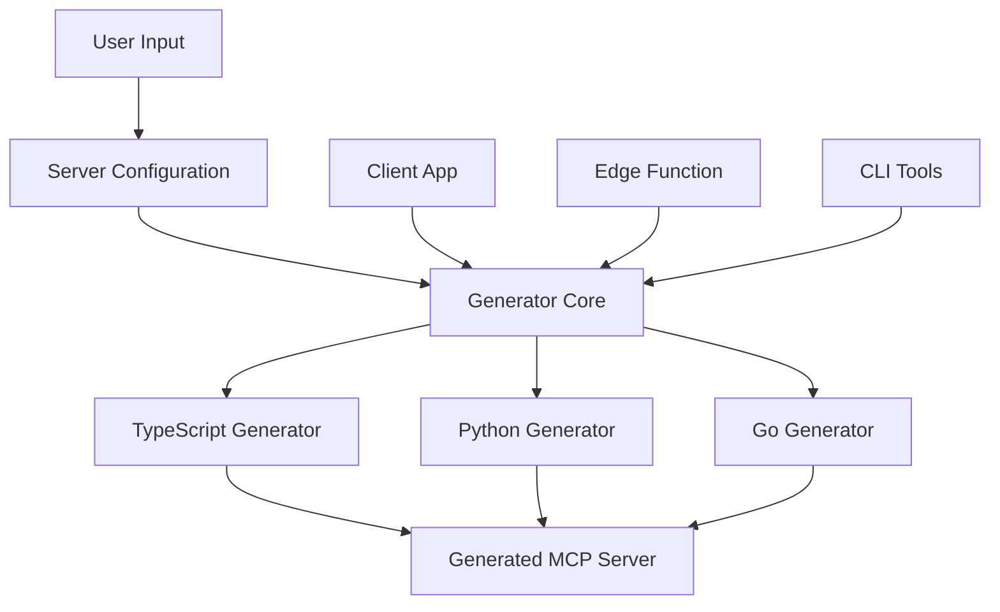

# MCP Server Generation

This document explains the MCP server generation functionality of our platform, which enables users to generate fully functional MCP-compatible servers based on configuration.

## Overview

The MCP server generation system allows you to:

1. Create MCP servers in multiple languages (TypeScript, Python, Go)
2. Configure authentication, hosting options, and endpoints
3. Map API endpoints to MCP resources and tools
4. Download the generated server for local deployment or deployment to the cloud
5. Generate servers using both client-side code and Supabase Edge Functions

## Architecture

The server generation system uses a core generation module that's shared between:

- Client-side generator (for quick previews and testing)
- Edge function generator (for production deployments)
- CLI tools (for automated testing and debugging)



## Core Components

### 1. Server Configuration

A server configuration defines:

- **Basic Information**: Name, description, language
- **Authentication**: Type (None, API Key, Bearer Token, Basic Auth), location, name
- **Hosting**: Provider (AWS, GCP, Azure, Self-hosted), type (Serverless, Container, VM), region
- **Endpoints**: Paths, methods, parameters, responses, and MCP mappings (resource or tool)

Example:
```json
{
  "name": "Weather API Server",
  "description": "An MCP server for accessing weather data",
  "language": "TypeScript",
  "authentication": {
    "type": "API Key",
    "location": "header",
    "name": "x-api-key"
  },
  "hosting": {
    "provider": "AWS", 
    "type": "Serverless",
    "region": "us-east-1"
  },
  "endpoints": [...]
}
```

### 2. Generator Core

The core generator (`serverGeneratorCore.ts`) is responsible for:

- Validating the server configuration
- Selecting the appropriate language-specific generator
- Providing a consistent interface for all generator implementations

### 3. Language-Specific Generators

We support three main languages:

- **TypeScript**: Server with Express framework
- **Python**: Server with FastAPI framework
- **Go**: Server with Gin framework

Each language generator creates:
- Main server file with API endpoints
- Configuration files
- Authentication middleware (if needed)
- MCP integration code
- Documentation

### 4. Client Integration

The system is integrated into the UI through:

- **GenerateServer.tsx**: Main UI component for server generation
- **generateServerForUI.ts**: Utility to handle server generation from UI components
- **serverGeneratorv1.ts**: Local generator implementation

### 5. Edge Function

For production use, the system includes a Supabase Edge Function that:

- Receives server configuration from client
- Validates and processes the request
- Uses the shared generator core
- Saves the result to the database
- Returns the generation result

## Testing & Development

To test server generation:

1. Use the CLI tools in the `test-mcp` directory
2. Run sample configurations for each language
3. Examine the generated servers

```bash
# Generate a TypeScript server
node test-mcp/run-all-tests.js

# Or individually
npx ts-node test-mcp/generate-mcp-server.ts test-mcp/sample-config.json ./output
```

## Output 

The generator produces:

1. Source code files
2. Configuration files (package.json, requirements.txt, go.mod)
3. README documentation
4. .env example files for configuration

## Extending the System

To add support for a new language:

1. Create a new generator module (e.g., `rustServer.ts`)
2. Implement the generator interface
3. Update the core generator to include the new language
4. Add sample configurations and tests

To add new endpoint types or authentication methods:

1. Update the server configuration type definitions
2. Modify the relevant generator modules to support the new features
3. Update the UI components to allow users to configure these features
4. Add tests for the new functionality

## Troubleshooting

If server generation fails:

1. Check the server configuration for errors
2. Examine the error message in the generation response
3. Try generating the server using the CLI tools for more detailed logs
4. Check the server deployment logs in the database
