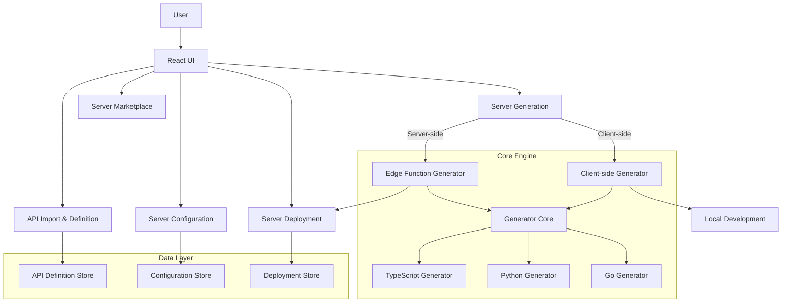
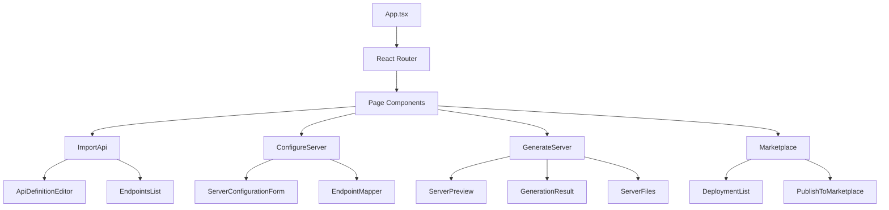
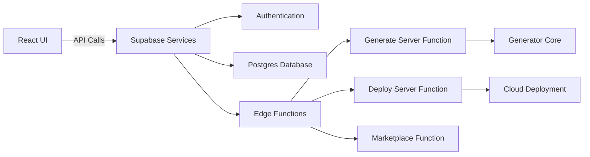
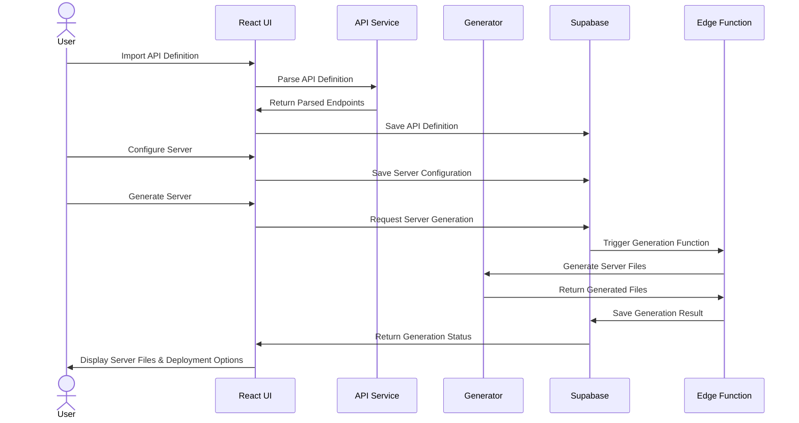

# MCP Server Magic - System Patterns

## System Architecture Overview

MCP Server Magic is built as a modern web application with a client-side React frontend and Supabase backend, utilizing edge functions for server-side processing. The system is organized into distinct functional modules that together create a pipeline from API definition to fully functional MCP server deployment.



## Component Relationships

### Frontend Components

The React frontend is structured around reusable components organized in a hierarchical manner:



The UI components follow a clear hierarchy that mirrors the user workflow, providing a consistent experience from API definition to server deployment.

### Backend Services



## Design Patterns

### Core Design Patterns

1. **Model-View-Controller (MVC)**
   - **Models**: TypeScript interfaces in `src/types/` define data structures
   - **Views**: React components in `src/components/` render UI 
   - **Controllers**: Service modules in `src/utils/` manage business logic

2. **Component-Based Architecture**
   - Modular UI components for reusability and maintainability
   - Clear separation of concerns among components
   - Composition pattern for building complex interfaces

3. **Service Abstraction**
   - API services encapsulate data operations
   - Generation services handle code generation logic
   - Deployment services manage server deployment operations

4. **Template Method Pattern**
   - Base generator defines the structure
   - Language-specific generators implement specialized steps
   - Shared core logic with language-specific variations

5. **Strategy Pattern**
   - Interchangeable authentication strategies
   - Pluggable hosting providers
   - Configurable endpoint mapping approaches

6. **Factory Pattern**
   - Generator factory creates appropriate language generator
   - Configuration factory builds server config objects
   - File generator creates appropriate server file objects

### Code Organization

The codebase is organized into the following key directories:

- `src/components/`: UI components including forms, modals, and displays
- `src/pages/`: Page-level components that represent routes
- `src/types/`: TypeScript interface definitions for the system
- `src/utils/`: Utility services and helper functions
- `src/contexts/`: React contexts for state management
- `supabase/functions/`: Edge functions for server-side operations
- `test-mcp/`: Testing utilities and sample configurations

## Data Flow



### Key Data Flows

1. **API Definition Flow**
   - User imports API specification (OpenAPI, etc.)
   - System parses and extracts endpoints
   - Endpoints are stored in database and mapped to MCP resources/tools
   - Configuration is paired with API definition

2. **Generator Flow**
   - Server configuration combined with endpoint mapping
   - Generator core selects appropriate language generator
   - Language-specific templates are populated
   - Files are generated with proper structure
   - Generated code is validated for correctness

3. **Deployment Flow**
   - Generated files are prepared for deployment
   - Deployment provider is configured
   - Files are deployed to chosen platform
   - Deployment status is tracked and reported
   - URL and access information is returned to user

## Integration Points

### External Integrations

1. **Cloud Provider Integrations**
   - AWS Lambda deployment
   - Google Cloud Functions
   - Azure Functions
   - Self-hosted options

2. **API Specification Standards**
   - OpenAPI (Swagger) import/export
   - RAML support
   - API Blueprint compatibility

3. **Authentication Providers**
   - OAuth integration
   - API key management
   - JWT handling

### Internal Integration Mechanisms

1. **Database Integration**
   - Supabase Postgres for structured data
   - Consistent data models across application
   - Real-time subscriptions for live updates

2. **State Management**
   - React Context for global state
   - React Query for data fetching and caching
   - Local state for component-specific concerns

3. **File System Integration**
   - Generation of downloadable file packages
   - ZIP archive creation for server downloads
   - File structure templating

## Technical Interfaces

### Core Interfaces

1. **ServerGenerator Interface**
   ```typescript
   interface ServerGenerator {
     generateServer(config: ServerConfig): Promise<GenerationResult>;
     validateConfig(config: ServerConfig): ValidationResult;
     getLanguageSupport(): LanguageSupport;
   }
   ```

2. **Deployment Interface**
   ```typescript
   interface DeploymentProvider {
     deployServer(files: ServerFile[], config: DeploymentConfig): Promise<DeploymentResult>;
     getStatus(deploymentId: string): Promise<DeploymentStatus>;
     removeDeployment(deploymentId: string): Promise<boolean>;
   }
   ```

3. **API Definition Interface**
   ```typescript
   interface ApiDefinitionParser {
     parseDefinition(content: string, format: ApiFormat): Promise<ApiDefinition>;
     extractEndpoints(definition: ApiDefinition): Endpoint[];
     validateDefinition(definition: ApiDefinition): ValidationResult;
   }
   ```

These core interfaces define the contracts between different system components, enabling modular development and extension.

## Architectural Decisions

1. **Client-Side Generation**
   - Allows immediate feedback during development
   - Reduces server load for simple generations
   - Enables offline development capabilities

2. **Edge Function Processing**
   - Provides scalable server-side generation
   - Handles complex processing without client-side limitations
   - Enables secure deployment operations

3. **Shared Core Generator**
   - Ensures consistency across environments
   - Reduces code duplication
   - Simplifies maintenance and extensions

4. **Template-Based Generation**
   - Provides clear structure for each language
   - Enables easy updates to generated code patterns
   - Allows customization of output formats

MCP Server Magic's architecture is designed for extensibility and maintainability, with clear separation of concerns and well-defined interfaces between components. This architecture enables the system to evolve with new language support, deployment options, and features while maintaining a consistent user experience and code quality.
